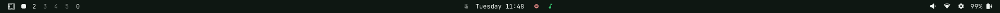
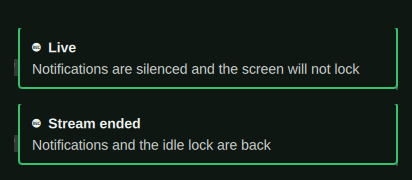

# Tally

A studio has a light on the camera that is live, so nobody has to guess which
one is on. This is that light, in the Omarchy bar, wired to OBS.


Dim while OBS is closed, plain while it is open, lit while the stream is going
out. Clicking it raises OBS, or starts it.



## Install

```bash
omarchy plugin add https://github.com/reeveng/omarchy-tally.git --enable
```

Put it where you like when it asks. Everything else is on by default.

## The stream takes the desk with it

Going live silences notifications and holds the screen awake, and the end of
the stream puts both back.



Only what the plugin turned on is turned off again. Somebody who already had do
not disturb on before going live still has it on afterwards, and somebody who
already keeps the screen awake never notices this plugin at all. The switches
are Omarchy's own, thrown the way a person throws them, so the indicators in
the bar say what is going on for as long as it lasts.

A shell that is restarted mid-stream lets go of what it was holding, which is
worth knowing on the day you edit your config while live: notifications come
back, and the light goes on saying you are live, because you are.

## What a stream can see, and what it should not

A screen capture takes the screen. Everything a keystroke can open is on
camera the moment it opens, and the drawers of a desk that has been worked at
for a year are full of things nobody meant to publish.

One command asks all of it and writes the answers down:

```bash
~/.config/omarchy/plugins/jmad.tally/bin/obs-tally-setup
```

It offers the browsers you actually have, since it reads the list from the ones
that told the desktop they can open a link, and it offers to build the empty
profile for whichever you pick. Every answer is a line in `shell.json` you
could have typed yourself, so the menu is a convenience and never the only way.

**Links open somewhere else.** Name a browser in `streamBrowser` and every link
opened while live goes there instead: `xdg-open` from a terminal, a link
clicked in a chat, a docs page an editor offers. Point it at a browser with an
empty profile and the address bar suggests nothing, the bookmarks bar carries
nothing, and no account is signed in.

```json
{ "id": "jmad.tally", "streamBrowser": "stream-browser.desktop" }
```

A desktop entry with its own profile directory is the point of the exercise,
and the one the menu writes looks like this:

```ini
[Desktop Entry]
Name=Stream Browser
Exec=chromium --class=stream-browser --user-data-dir=/home/you/.local/share/stream-browser %U
Type=Application
MimeType=x-scheme-handler/http;x-scheme-handler/https;text/html;
```

Write the path out in full. A desktop entry expands `%U` and nothing else, so
a tilde in there is a directory called `~`.

Your own `mimeapps.list` is never touched. The routing is a file the plugin
writes beside it, named for the desktop, which the spec puts above it and which
the end of the stream deletes.

**The drawers are empty.** The clipboard history, the recent files every file
dialog offers, and the notifications already waiting to be read are moved out
of reach while the stream is live and fetched back when it ends. Do not disturb
stops the next notification; this is about the ones from this morning. What was
copied during the stream is dropped along with the hiding place, on the grounds
that a stream's clipboard is nobody's history.

Each is a setting, and each is on by default:

| Key | What it hides |
| --- | --- |
| `hideClipboard` | `clipboard-history.json`, everything ever copied |
| `hideRecents` | `recently-used.xbel`, the recents in every file picker |
| `hideNotifications` | the notification centre's backlog |
| `hideHistory` | the shell history behind Ctrl-R and autosuggestion |

**When a drawer is not where it should be.** The three above are Omarchy's own
files, at the paths Omarchy keeps them at. Somebody whose clipboard lives in
cliphist or clipse has a history this does not know how to reach, and a later
Omarchy could move one of these without asking. Rather than hold nothing and
say the desk is clear, a hold that finds nothing to put away names what it
could not find, in a notification loud enough to arrive with do not disturb
already on. A machine that has never copied anything says the same thing, which
is the honest answer to the same question.

**The shell forgets too.** `hideHistory` wants one line in your `.zshrc` or
`.bashrc`, because a shell cannot be reached into from outside:

```bash
source ~/.config/omarchy/plugins/jmad.tally/shell/tally-history.sh
```

Every prompt after that asks whether the light is on, which costs a test on a
file and no process at all. While it is, zsh pushes the history onto its own
stack and starts an empty one that is never written anywhere; bash writes its
out, drops it, and reads it back at the end. Either way Ctrl-R answers with
nothing, autosuggestion offers nothing, and what you type during the stream is
forgotten when it ends. Shells already open when the light comes on are covered
at their next prompt.

**The bar says less.** A widget can be a leak with a mouse on it. Omarchy's
Tailscale panel lists every machine on your tailnet by name with a button to
copy its address, which is an inventory of your infrastructure one click from
anybody watching. Name such widgets in `hideWidgets` and they come off the bar
for the length of the stream:

```json
{ "id": "jmad.tally", "hideWidgets": ["omarchy.tailscale"] }
```

The entry is lifted out of the layout and kept beside `shell.json` with the
section and the place it held, so the bar comes back in the order it was in
rather than wherever the widget's own manifest would have put it.

**When the power goes out.** The desk is put away by moving things beside
themselves and the light going out is what fetches them back, so a machine that
died mid-stream would come back up with an empty clipboard and no way to know
better. Install the hook and the first thing a fresh desktop does is ask for
its history:

```bash
omarchy hook install post-boot ~/.config/omarchy/plugins/jmad.tally/hooks/jmad-tally-release
```

**What this cannot reach.** A terminal's own history is still a keystroke away,
and so is what an editor has open, what a shell prompt says about where it is,
and the stream key in OBS's own settings pane. Those are yours to keep shut.

## It reads the log, not the websocket

OBS writes `==== Streaming Start ====` and `==== Streaming Stop ====` into the
log of the session it is running. Whichever came last is the answer, and
`pgrep` settles whether OBS is there at all.

So there is nothing to install inside OBS, no websocket to enable, no port
listening and no password anywhere. The cost of that is what a log can tell
you: this knows about streaming and says nothing about recording, and it learns
about a stream when the poll comes round rather than the instant it starts.

## Settings

| Key | Default | What it does |
| --- | --- | --- |
| `intervalMs` | `3000` | How often OBS is asked what it is doing |
| `quiet` | `true` | Do not disturb goes on for the length of the stream |
| `stayAwake` | `true` | The idle lock and the screensaver stay off |
| `announce` | `true` | A notification as the stream starts, and another as it ends |
| `streamBrowser` | `""` | The desktop entry links open in while live |
| `hideClipboard` | `true` | The clipboard history is put away for the stream |
| `hideRecents` | `true` | So are the recent files every file dialog offers |
| `hideNotifications` | `true` | So is the notification centre's backlog |
| `hideHistory` | `true` | Ctrl-R and autosuggestion answer with nothing |
| `hideWidgets` | `[]` | Bar widgets that come off the bar while live |

From `obs-tally-setup`, from the bar's own settings, or from a terminal:

```bash
omarchy bar set jmad.tally announce false --json
omarchy bar set jmad.tally intervalMs 5000 --json
```

One entry configures both halves. The bar widget and the service read the same
line of `shell.json`.

## Seeing it without going live

A tally light is hard to look at on purpose. It wants a stream, and a stream
wants somewhere to send it. So there is a word you can write down instead:

```bash
~/.config/omarchy/plugins/jmad.tally/bin/obs-tally-simulate live
~/.config/omarchy/plugins/jmad.tally/bin/obs-tally-simulate off
```

`live`, `idle` and `closed` are taken over anything OBS says, and `off` gives
the question back to OBS. The whole plugin runs on it: the dot lights, the
stream is announced, notifications go quiet. Every picture in this README was
taken that way, with OBS closed the entire time.

## The scripts on their own

Both are plain bash, neither needs the bar, and both sit in `bin/` where the
plugin was cloned to. Symlink them into `~/.local/bin` if you want them under
your fingers, on a keybinding or in a stream deck script.

```bash
cd ~/.config/omarchy/plugins/jmad.tally/bin

./obs-tally-state                # live, idle, or closed
./obs-tally-hold hold            # put the desk away, remembering what it changed
./obs-tally-hold hold --browser chromium.desktop --hide-widget omarchy.tailscale
./obs-tally-hold release         # put back only that
./obs-tally-hold status
```

`OBS_LOG_DIR` moves the directory the logs are read from. `obs-tally-hold`
keeps what it changed in `$XDG_RUNTIME_DIR`, so a second `hold` while one is
running does nothing and a reboot forgets it. What it puts away it puts beside
itself under `.stream-held`, which a `release` finds whether or not that file
survived.

## The service without the light

The bar widget carries the service with it. To take the quiet without the dot,
leave the widget off the bar and put the plugin in `plugins[]` in
`~/.config/omarchy/shell.json`:

```json
{ "id": "jmad.tally", "announce": true }
```

## Removing it

The desk is put back by the same scripts that put it away, so let go of
anything still held before the plugin goes:

```bash
~/.config/omarchy/plugins/jmad.tally/bin/obs-tally-hold release
omarchy plugin remove jmad.tally
```

That takes the widget off the bar and deletes the folder. Two things live
outside it and stay behind. The `source` line in your `.zshrc` or `.bashrc` now
points at a file that is not there, and every new shell will say so until you
delete the line. The hook, if you installed it, is a copy:

```bash
rm ~/.config/omarchy/hooks/post-boot.d/jmad-tally-release
```

Nothing else was ever written. Do not disturb, the idle lock, the clipboard
history and the recent files are yours again the moment the release runs, and
your own `mimeapps.list` was never touched to begin with.

## Requirements

Omarchy, with the shell's plugin directory (`omarchy plugin list` answers). OBS
Studio, for there to be anything to say.

Nothing is installed beyond the plugin itself. The scripts are bash and lean on
`jq` and `pgrep`, which Omarchy already has, and on `omarchy` for every switch
they throw. Writing a stream browser's desktop entry uses
`update-desktop-database` where it exists and skips it where it does not.

## Licence

MIT. See [LICENSE](LICENSE).
