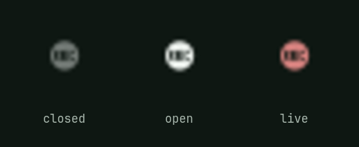

# Tally

A studio has a light on the camera that is live, so nobody has to guess which
one is on. This is that light, in the Omarchy bar, wired to OBS.



Dim while OBS is closed, plain while it is open, lit while the stream is going
out. Clicking it raises OBS, or starts it.


## Install

```bash
omarchy plugin add https://github.com/reeveng/omarchy-tally.git --enable
```

Put it where you like when it asks. Everything else is on by default.

## The stream takes the desk with it

Going live silences notifications and holds the screen awake, and the end of
the stream puts both back.


Only what the plugin turned on is turned off again. Somebody who already had do
not disturb on before going live still has it on afterwards, and somebody who
already keeps the screen awake never notices this plugin at all. The switches
are Omarchy's own, thrown the way a person throws them, so the indicators in
the bar say what is going on for as long as it lasts.

A shell that is restarted mid-stream lets go of what it was holding, which is
worth knowing on the day you edit your config while live: notifications come
back, and the light goes on saying you are live, because you are.

## It reads the log, not the websocket

OBS writes `==== Streaming Start ====` and `==== Streaming Stop ====` into the
log of the session it is running. Whichever came last is the answer, and
`pgrep` settles whether OBS is there at all.

So there is nothing to install inside OBS, no websocket to enable, no port
listening and no password anywhere. The cost of that is what a log can tell
you: this knows about streaming and says nothing about recording, and it learns
about a stream when the poll comes round rather than the instant it starts.

## Settings

| Key | Default | What it does |
| --- | --- | --- |
| `intervalMs` | `3000` | How often OBS is asked what it is doing |
| `quiet` | `true` | Do not disturb goes on for the length of the stream |
| `stayAwake` | `true` | The idle lock and the screensaver stay off |
| `announce` | `true` | A notification as the stream starts, and another as it ends |

From the bar's own settings, or from a terminal:

```bash
omarchy bar set jmad.tally announce false --json
omarchy bar set jmad.tally intervalMs 5000 --json
```

One entry configures both halves. The bar widget and the service read the same
line of `shell.json`.

## Seeing it without going live

A tally light is hard to look at on purpose. It wants a stream, and a stream
wants somewhere to send it. So there is a word you can write down instead:

```bash
~/.config/omarchy/plugins/jmad.tally/bin/obs-tally-simulate live
~/.config/omarchy/plugins/jmad.tally/bin/obs-tally-simulate off
```

`live`, `idle` and `closed` are taken over anything OBS says, and `off` gives
the question back to OBS. The whole plugin runs on it: the dot lights, the
stream is announced, notifications go quiet. Every picture in this README was
taken that way, with OBS closed the entire time.

## The scripts on their own

Both are plain bash, neither needs the bar, and both sit in `bin/` where the
plugin was cloned to. Symlink them into `~/.local/bin` if you want them under
your fingers, on a keybinding or in a stream deck script.

```bash
cd ~/.config/omarchy/plugins/jmad.tally/bin

./obs-tally-state                # live, idle, or closed
./obs-tally-quiet hold           # silence and hold, remembering what it changed
./obs-tally-quiet release        # put back only that
./obs-tally-quiet status
```

`OBS_LOG_DIR` moves the directory the logs are read from. `obs-tally-quiet`
keeps what it changed in `$XDG_RUNTIME_DIR`, so a second `hold` while one is
running does nothing and a reboot forgets it.

## The service without the light

The bar widget carries the service with it. To take the quiet without the dot,
leave the widget off the bar and put the plugin in `plugins[]` in
`~/.config/omarchy/shell.json`:

```json
{ "id": "jmad.tally", "announce": true }
```

## Requirements

Omarchy, with the shell's plugin directory (`omarchy plugin list` answers). OBS
Studio, for there to be anything to say.

## Licence

MIT. See [LICENSE](LICENSE).
